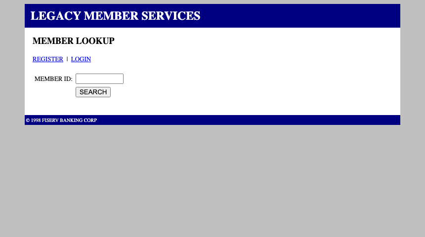
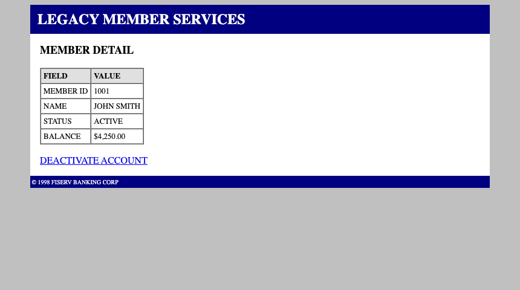
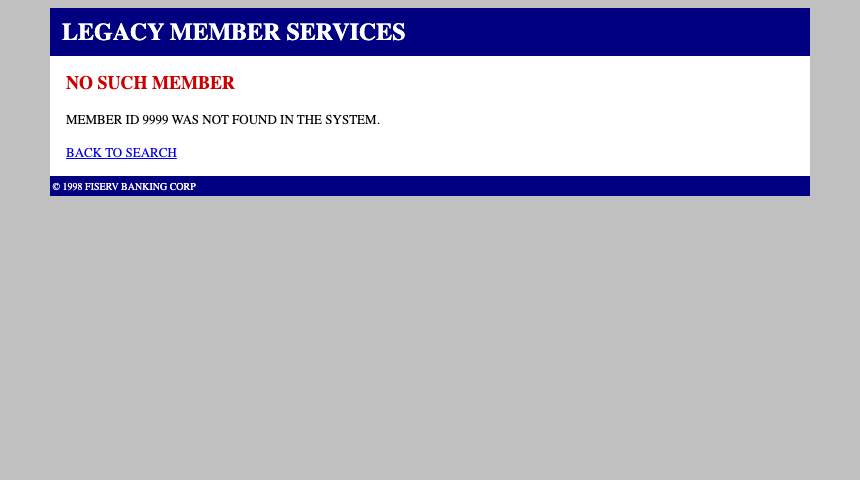

# Computer-Use Automation System

> **interface.ai — Engineering take-home project**

An LLM-driven system that gives AI agents hands on legacy software that has **no API**: it *discovers* how to operate a UI, *records* the successful run as a structured artifact, and *replays* it deterministically — **no LLM in the loop** — so an agent can invoke it reliably and cheaply in production.

The whole project is three blocks: a **core engine** (discover → record → replay), an **admin console** (manage and create tasks), and a **user-facing runner** (use tasks). This README is the single source of truth; the formal submission write-up lives in [`REPORT.md`](REPORT.md).

---

## 1. Installation & Usage

### 1.1 Requirements

- Python 3.12
- Network access to the target sites (for the two live demo sites)

### 1.2 Install

```bash
python3 -m venv .venv && source .venv/bin/activate
pip install -r requirements.txt
playwright install chromium
```

### 1.3 Configure

```bash
cp .env.example .env      # fill in the two API keys (optional — see below)
```

There are two LLM roles, both **provider-agnostic** — point each at any OpenAI-compatible endpoint (DeepSeek, Kimi/Moonshot, OpenAI, OpenRouter, a local vLLM, …). See `.env.example` for a multi-provider template.

> **You only need keys to *record new* tasks.** Viewing and replaying the pre-recorded tasks needs **no keys at all** — replay is deterministic, no LLM in the loop.

### 1.4 Run

```bash
# start the local target app (a "legacy bank" mock, port 9000)
python3 mock-app/server.py

# start the dashboard (port 8123) — serves BOTH interfaces
.venv/bin/python -m dashboard.server
```

Then open:

| URL | Who it's for | What it does |
|---|---|---|
| `http://localhost:8123/` | **Admin console** | Manage tasks, view locator detail + screenshots, run/verify, statistics report (per-task rates + one-click replay), delete, register new tasks |
| `http://localhost:8123/user` | **User runner** | Pick a task from a dropdown → fill its inputs → run → see the result |

### 1.5 Test suite

```bash
./scripts/run_tests.sh
```

Boots the mock and runs the real end-to-end suite (discovery → artifact → replay across all three states → safety/encryption/handoff → vision fallback → observability). It makes **real LLM calls** — a genuine run, not a stub.

---

## 2. Project Structure

### 2.1 The three blocks

```
                 ┌───────────────────────────────────────────────┐
                 │  ENGINE  (agent/)                             │
                 │                                               │
   new task  ──► │  DISCOVERY (LLM, once)   observe→decide→act   │
                 │       │                                       │
                 │       ▼  distills to a Capability artifact    │
                 │  REPLAY   (deterministic, forever)            │
                 │       act→assert→branch,  three-state result  │
                 └───────────────┬───────────────────────────────┘
                                 │
          ┌──────────────────────┴──────────────────────┐
          │                                             │
   ┌──────▼───────┐                            ┌────────▼────────┐
   │ ADMIN console │  (/)                      │ USER runner    │ (/user)
   │ manage + create │                          │ just use tasks │
   └──────────────┘                            └─────────────────┘
```

Both interfaces are thin HTTP frontends over the **same** engine and the same `POST /api/run` replay endpoint. They differ only in what they expose: the admin console adds create/delete/monitor, the user runner strips all of that down to "pick → fill → run → result".

### 2.2 Directory layout

```
agent/        the engine — discovery loop, artifact model, deterministic replay,
              safety, encryption, observability
dashboard/    both web interfaces — server.py, index.html (admin), user.html (runner),
              screenshots/
mock-app/     a deliberately-hostile local stand-in for a legacy bank back-office app
artifacts/    the recorded solution paths — one Capability JSON per task (version-controlled)
evidence/     raw discovery transcripts + append-only run logs (inputs encrypted at rest)
scripts/      one-command tests, screenshot/evidence generators, artifact helpers
```

### 2.3 The demo target — a "legacy bank" mock

The local target (`mock-app/`, port 9000) is a deliberately-hostile stand-in for the kind of legacy back-office software interface.ai's agents must drive. It is styled like a 1998-era banking portal — dated DOM, terse labels, no modern JS — because that is the hardest, most representative surface.

<p>
  
  
  
  
</p>

Left to right: the **member lookup** entry form (one `MEMBER ID` input + `SEARCH`), the **member detail** page (a FIELD/VALUE table the replay extracts outputs from), a **business_outcome** ("no such member" — a valid answer, not a crash), and a **failure** (deactivating a restricted account).

The mock is **multi-modal** — the same endpoint returns a different outcome per input, so a single recorded flow exercises all three result states:

| `member_id` | Result |
|---|---|
| `1001` | JOHN SMITH · ACTIVE · $4,250.00 |
| `1002` | JANE DOE · RESTRICTED · $12.80 (deactivate → access denied) |
| `1003` | ROBERT CHEN · ACTIVE · $18,900 |
| `9999` | no such member |

There are also register/login flows (username/password, with taken/invalid states) — all visible in the admin console's task list.

### 2.4 The data flow

1. **Discover** — the decision LLM is shown a live browser (URL + accessibility tree + a numbered control menu) and decides one action at a time. Image-only surfaces fall back to a vision model.
2. **Record** — the successful transcript is distilled into a `Capability`: typed steps, locator *strategies* (role+name, never pixels), per-step assertions, first-class error states.
3. **Replay** — a deterministic engine re-runs the artifact: it re-resolves each locator against the live page, acts, then classifies the result into one of **three states** (`success` / `business_outcome` / `failure`).

---

## 3. Design Features

### 3.1 Core principles

- **The model discovers; the artifact replays.** The LLM appears exactly once, during discovery. Production runs never pay for a model.
- **Three-state result contract.** "no such member" is a *business_outcome* (a valid answer), not a *failure* — a hard stop is distinct from a legitimate answer.
- **Intent, not coordinates.** Artifacts record *how to locate* a control (role + name), so one recorded on institution A applies to differently-branded institution B.
- **Every step asserts.** A click's success is never assumed; each step declares what it expects.
- **Repeated-control disambiguation.** A real storefront has six identical "Add to cart" buttons; locators record their position *within* the name group (`name_ordinal`).
- **Async-render (SPA) waiting.** Real sites render results after navigation; replay polls for the success signal before judging failure.
- **Reasoning-model output drift.** Reasoning LLMs spend most of their budget on a monologue and can return empty `content`; a generous budget + `reasoning_content` fallback + retry makes that self-heal.

### 3.2 Real-time statistics & monitoring

Every invocation is **recorded, measured, and re-runnable**:

- **Append-only run store.** Each replay is one JSON file under `evidence/runs/`, keyed by task + timestamp + result — nothing is ever overwritten.
- **Real-time rates.** The telemetry layer aggregates, per task + version: `success`, `business_outcome`, `failure` counts and their **rates** (`success_rate`, `business_rate`, **`failure_rate`**). So yes — if a task starts erroring, the error rate is visible immediately.
- **Failure inbox.** Every non-success run lands in an unresolved-failures inbox; a maintainer marks them resolved after a fix.
- **Replay-the-error loop.** Any failure can be re-run deterministically with its exact original inputs to reproduce and verify a fix.
- **Statistics report (admin console).** A live report that aggregates, per task, the `success` / `business_outcome` / `failure` counts **and rates** (with a rate bar), then lists every invocation: successes show timestamp + duration + extracted numbers, failures show the **encrypted** input (`enc:…`, never decrypted in the report) + diagnostic. Every row has a **↻ Replay** button that re-runs that exact invocation with its original inputs.

### 3.3 Privacy & encryption

Customer-entered values are treated as secrets end to end:

- **AES-256-GCM encryption at rest.** Every input value is encrypted *before* it touches disk; the run log and artifacts never store plaintext customer data.
- **Decrypt only at the moment of use.** Replay decrypts an input solely to type it into the target form, then it is gone.
- **The report never reveals decrypted failure inputs.** A failed run appears in the admin report as ciphertext (`enc:…`); replaying it decrypts server-side only at the moment of use, so even an operator reading the report never sees the customer's raw value.
- **Per-tenant keys.** The master key derives a separate key per tenant (`SHA-256(master ‖ tenant)`), so one tenant's data is unreadable with another's key.
- **Authenticated encryption.** Wrong key or tampering raises — ciphertext can't silently decrypt to garbage.
- **Key never committed.** The master key lives in the environment (or a KMS in production), never in the repo.
- **Structure vs. data.** The locator strategy (UI structure) stays plaintext so artifacts remain reviewable; only the customer *data* is ciphertext.
- **Safety allowlist + human handoff.** Actions are allowlisted in both discovery and replay; a hard failure pauses to a human operator who can resume the live session.

### 3.4 Known limitations & concrete solutions

These are deliberate, honest scoping decisions — each with a concrete path to implement, not a blind gap.

**Relative-position / coordinate clicking (the big one).**
Some legacy surfaces are canvas- or image-only: no DOM, no accessibility tree, so nothing can be located by role+name. Today the vision fallback *describes* such screens (including a recommended click point), but there is no "click at coordinates" action, so we can't actually drive them. The concrete plan:

1. The `visual` locator strategy is **already reserved** in the schema — extend the action vocabulary with a coordinate click (`click_at`).
2. **Record relative, not absolute.** During discovery, store the click point as an offset from a detected *landmark* (e.g. "the CONTINUE button center, relative to the page's bounding box") — never raw pixels, which break on any viewport/resolution change.
3. **Re-locate at replay time.** Re-run the vision model on the current screenshot to re-find the landmark and re-compute the click point, then `page.mouse.click(x, y)`. This makes it robust to resize, scroll, and different screens.
4. **Guard it.** Coordinate clicking is inherently less reliable than semantic locators, so it's an explicit, flagged per-step fallback that re-asserts after the click and escalates to a human on mismatch.

The honest tradeoff: this re-introduces a vision model into the replay path for *those specific steps* (bending the "no LLM in replay" invariant), which is why it's opt-in and kept out of the common path — and why we reserved it but haven't built it yet: the target back-office apps are DOM-based, so it's a rare fallback whose full cost (relative anchoring + re-location) didn't pay off for the mock/sauce-demo targets.

**Other scoped-out items (with known paths):**
- **Capability deduplication** — collapse "same flow, different parameter" into one task via a flow fingerprint.
- **Automatic error-state discovery** — a negative-testing pass to discover `business_outcome`/`failure` signals automatically (today they're patched in).
- **Generalized output extraction** — extend extraction beyond key-value tables to free-text result pages.
- **Multi-tenant / queue / cluster plumbing** — deliberately omitted; the depth went into the artifact schema, the error taxonomy, and handoff.
- **General commercial sites** — scoped to automation-friendly test sites (SauceDemo, The Internet); general sites sit behind ToS, CAPTCHAs, and WAFs that are out of scope.

---

## 4. Summary

This project answers one question: **how does an AI agent operate a system that has no API?** The answer is a design, not a Playwright wrapper:

- The **model discovers once** — it learns a task by driving a real browser, then leaves the loop.
- The **artifact replays forever** — what it learned is distilled into a typed, reviewable capability that deterministic code re-runs cheaply and reliably.
- **Errors are first-class** — a three-state result (success / business-outcome / failure) plus telemetry, a failure inbox, and a repair loop turn "the automation broke" into "here's the failing run, reproduce it, fix it, re-verify it."
- **Customer data is a secret** — AES-256-GCM, per-tenant keys, encrypt-at-rest / decrypt-at-use, and a human handoff for hard failures.

It's proven against two kinds of target: a deliberately-hostile local mock *and* two live, publicly-deployed sites. Seven recorded tasks span three domains (local mock, SauceDemo, The Internet), all verified — including an 11-step checkout flow against a live React storefront that forced three real-world fixes (repeated-control disambiguation, SPA async-render waiting, reasoning-model output drift).

The key win: separating *discovery* from *replay* is what makes this a design rather than "a model that clicks around" — production runs never pay for an LLM, and every run is deterministic, observable, and private.
